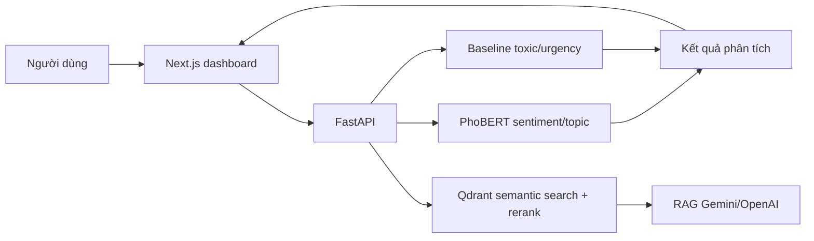

# Student Voice Intelligence

Hệ thống NLP phân tích phản hồi sinh viên tiếng Việt. Project kết hợp data pipeline,
PhoBERT, FastAPI, Qdrant và Next.js để phân tích feedback, truy xuất ngữ nghĩa và tổng hợp có dẫn chứng.

**Trạng thái:** v3.0.0 đã hoàn thành và được kiểm thử local: 25 pytest cases pass, bộ đánh giá RAG 8/8 case pass.

## Mục tiêu

Project xử lý các phản hồi dạng text và dự đoán:

- `sentiment`: positive / neutral / negative
- `topic`: nhóm chủ đề phản hồi
- `toxic`: có ngôn ngữ độc hại/xúc phạm hay không
- `urgency`: mức độ cần xử lý low / medium / high

## Tổng quan 



Dashboard chính tại Next.js hỗ trợ:

- Theo dõi tổng quan và phân tích dữ liệu phản hồi.
- Dự đoán sentiment, topic, toxic và urgency cho phản hồi mới hoặc file CSV.
- Tìm kiếm ngữ nghĩa và hỏi đáp RAG có dẫn chứng.
- Duyệt thủ công urgency, khám phá chủ đề mới và sinh báo cáo tự động.

## Khởi động nhanh

Cần có Docker Desktop, dữ liệu đã xử lý tại `data/processed/` và model tại `outputs/models/`.
Khởi động stack chính:

```bash
docker compose up --build -d
```

Truy cập Next.js dashboard tại `http://localhost:8501` và Swagger API tại
`http://127.0.0.1:8000/docs`.

Gateway Nginx được mở tại `http://localhost:8080` để gom dashboard và API
vào cùng một origin. Đây là URL nên dùng khi demo hoặc khi chạy Cloudflare
Tunnel:

- Dashboard qua gateway: `http://localhost:8080`
- API health qua gateway: `http://localhost:8080/api/health`
- Dashboard trực tiếp để debug: `http://localhost:8501`
- API trực tiếp để debug: `http://127.0.0.1:8000`

Streamlit `http://localhost:8502`.

## Trạng thái hiện tại

- **Dữ liệu và tiền xử lý:** gộp NEU-ESC + UIT-VSFC, chuẩn hóa schema, EDA và enrichment cho toxic, urgency, topic_group.
- **Mô hình phân loại:** huấn luyện baseline TF-IDF, fine-tune Transformer cho sentiment/topic, so sánh nhiều biến thể và chọn
PhoBERT-base-v2 cho sentiment, `topic_phobertv2_noweight` cho topic.
- **Inference và API:** xây dựng FastAPI service, batch prediction CSV, Docker runtime và automated API tests.
- **Dashboard:** xây dựng dashboard Next.js/Tailwind cho analytics, prediction, CSV, semantic search, RAG, review urgency, topic
discovery và report generation.
- **Semantic search và RAG:** xây dựng Qdrant vector search với Vietnamese SBERT, CrossEncoder reranking và RAG chatbot có evidence/
citation qua Gemini hoặc OpenAI.
- **Đánh giá và báo cáo:** có test tự động, bộ đánh giá RAG, report generation và các báo cáo thực nghiệm cho baseline/Transformer/
retrieval/RAG.

## Cấu trúc thư mục

```text
Student Voice Intelligence/
|
|-- notebook/
|   |-- data/
|   |   |-- data_merge.ipynb
|   |   |-- eda.ipynb
|   |   |-- label_enrichment.ipynb
|   |   `-- llm_review_urgency.ipynb
|   |
|   `-- baseline/
|       |-- baseline_models.ipynb
|       `-- 06_baseline_inference_demo.ipynb
|   |
|   |-- demo/
|   |   `-- inference_student_voice.ipynb
|   |
|   `-- transformer/
|       |-- train_xlmr_sentiment.ipynb
|       |-- train_phobertv2_sentiment.ipynb
|       |-- train_videberta_sentiment.ipynb
|       |-- train_phobertlarge_sentiment.ipynb
|       |-- train_phobertv2_topic.ipynb
|       |-- train_phobertv2_topic_noweight.ipynb
|       `-- train_phobertv2_topic_sqrt_weight.ipynb
|
|-- src/
|   |-- inference.py
|   |-- retrieval.py            # Qdrant retrieval + CrossEncoder rerank
|   |-- reranker.py
|   |-- rag.py                  # Gemini/OpenAI grounded generation
|   |-- analytics.py
|   |-- storage.py              # SQLite state store
|   |-- reviews.py              # manual urgency review
|   |-- reporting.py
|   `-- topic_discovery.py
|
|-- api/
|   |-- __init__.py
|   `-- app.py
|
|-- dashboard/
|   `-- app.py                 # Streamlit UI, gọi FastAPI
|
|-- web/                       # Next.js + Tailwind dashboard chính
|   |-- app/
|   `-- components/
|
|-- scripts/
|   |-- build_vector_index.py  # Tạo embedding và upsert vào Qdrant
|   `-- evaluate_rag.py        # Chạy bộ đánh giá RAG
|
|-- tests/
|   |-- test_api.py            # API contract tests
|   |-- test_retrieval.py
|   `-- test_v3_features.py
|
|-- data/
|   |-- evaluation/rag_test_cases.csv
|   `-- processed/              # ignored by git
|
|-- datasets/                   # ignored by git
|-- outputs/
|   |-- reports/                # report kết quả
|   |-- figures/                # ignored by git
|   |-- models/                 # ignored by git
|   `-- app_state/              # SQLite local state, ignored by git
|
|-- PLAN.md
|-- note.txt
|-- requirements.txt
|-- .env.example
|-- Dockerfile
|-- .dockerignore
|-- docker-compose.yml
`-- feedback.csv               # sample CSV cho /predict-csv
```

## Data

Project dùng 2 dataset:

- NEU-ESC: `hung20gg/NEU-ESC`
- UIT-VSFC: `uitnlp/vietnamese_students_feedback`

## File data chính

```text
data/processed/student_voice_enriched_reviewed.csv
```

File này gồm:

- data đã merge và chuẩn hóa
- `sentiment_std_3class`
- `topic_group`
- `is_toxic`
- `urgency_level_final`

## LLM API key

File `.env`:

```text
OPENAI_API_KEY=sk-...
```

## Kết quả data hiện tại

Sau merge:

```text
Rows: 49,141
Columns: 11
Empty text rows: 0
Duplicate text rows: 1
```

Sau LLM review urgency:

```text
Review candidates: 921
LLM reviewed rows: 921
LLM/rule disagreements: 309
Final urgency:
  low:    48,764
  medium:    335
  high:       42
```

## Kết quả baseline

Best test results hiện tại:

| Task | Best model | Accuracy | Macro-F1 | Weighted-F1 |
|---|---|---:|---:|---:|
| sentiment_3class | TF-IDF + Linear SVM | 0.819 | 0.812 | 0.819 |
| topic_group | TF-IDF + Linear SVM | 0.815 | 0.658 | 0.816 |
| toxic_binary | TF-IDF + Linear SVM | 0.992 | 0.901 | 0.991 |
| urgency_final | TF-IDF + Linear SVM | 0.996 | 0.751 | 0.996 |

## Kết quả Transformer sentiment

Đã fine-tune và đánh giá 4 Transformer cho task:

```text
sentiment_std_3class
```

Kết quả test:

| Rank | Model | Accuracy | Macro-F1 | Weighted-F1 | Ghi chú |
|---:|---|---:|---:|---:|---|
| 1 | `vinai/phobert-base-v2` | 0.860 | 0.858 | 0.860 | Model sentiment chính |
| 2 | `vinai/phobert-large` | 0.855 | 0.853 | 0.855 | Nặng hơn nhưng không tốt hơn base-v2 |
| 3 | `FacebookAI/xlm-roberta-base` | 0.855 | 0.852 | 0.855 | Multilingual baseline tốt |
| 4 | `Fsoft-AIC/videberta-base` | 0.735 | 0.710 | 0.729 | Không cần ưu tiên tiếp |
| 5 | `TF-IDF + Linear SVM` | 0.819 | 0.812 | 0.819 | Baseline classic |

Kết luận:

```text
vinai/phobert-base-v2
```

là model sentiment tốt nhất hiện tại.

Bảng tổng hợp sentiment:

```text
outputs/reports/transformer/sentiment_model_comparison.csv
outputs/reports/transformer/sentiment_model_comparison.md
```

## Kết quả Transformer topic

Đã fine-tune `topic_group` với `vinai/phobert-base-v2` theo 3 biến thể:

| Rank | Model topic | Accuracy | Macro-F1 | Weighted-F1 | Ghi chú |
|---:|---|---:|---:|---:|---|
| 1 | `topic_phobertv2_noweight` | 0.848 | 0.722 | 0.846 | Model topic chính |
| 2 | `topic_phobertv2_sqrt_weight` | 0.839 | 0.722 | 0.841 | Gần bằng no-weight, tốt hơn cho một số lớp nhỏ |
| 3 | `topic_phobertv2` full weight | 0.830 | 0.716 | 0.835 | Bị class weight kéo mạnh, không chọn làm model chính |
| 4 | `TF-IDF + Linear SVM` | 0.815 | 0.658 | 0.816 | Baseline classic |

Kết luận:

```text
topic_phobertv2_noweight
```

là model topic chính hiện tại vì có accuracy, macro-F1 và weighted-F1 cao nhất.

## Demo FastAPI

FastAPI dùng chung logic với notebook demo trong:

```text
src/inference.py
```

API app nằm ở:

```text
api/app.py
```

Cài dependencies:

```bash
pip install -r requirements.txt
```

Chạy API từ thư mục project:

```bash
uvicorn api.app:app --reload
```

Mở Swagger UI:

```text
http://127.0.0.1:8000/docs
```

Các endpoint chính:

```text
GET  /
GET  /health
GET  /model-info
POST /predict
POST /predict-batch
POST /predict-csv
```

Ví dụ request `POST /predict`:

```json
{
  "text": "Wifi phòng học quá yếu, máy chiếu bị mờ nên rất khó học."
}
```

Ví dụ response:

```json
{
  "text": "Wifi phòng học quá yếu, máy chiếu bị mờ nên rất khó học.",
  "sentiment": "negative",
  "sentiment_confidence": 0.9895,
  "topic": "facilities",
  "topic_confidence": 0.9709,
  "toxic": 0,
  "urgency": "medium"
}
```

### Dự đoán từ CSV

Endpoint `POST /predict-csv` nhận một file CSV UTF-8 có cột bắt buộc `text`, tối đa
5,000 dòng. Response là file `student_voice_predictions.csv`, giữ lại các cột gốc
và thêm `sentiment`, `topic`, `toxic`, `urgency` cùng confidence của sentiment/topic.

Ví dụ dùng `curl`:

```bash
curl -X POST http://127.0.0.1:8000/predict-csv -F "file=@feedback.csv" -o student_voice_predictions.csv
```

Ví dụ `feedback.csv`:

```csv
student_id,text
sv-01,Wifi phòng học quá yếu.
sv-02,Giảng viên dạy dễ hiểu và nhiệt tình.
```

## Docker

Cần cài và mở Docker Desktop trước khi chạy. Docker image dùng PyTorch CPU-only,
chỉ chứa code và dependencies; model được mount từ máy host để không đưa model
nặng lên Git.

Build image từ thư mục project:

```bash
docker build -t student-voice-api:1.0.0 .
```

Chạy container trên PowerShell và mount model theo chế độ chỉ đọc:

```powershell
docker run --rm -p 8000:8000 `
  -v "${PWD}\outputs\models:/app/outputs/models:ro" `
  student-voice-api:1.0.0
```

Kiểm tra API từ một cửa sổ PowerShell khác:

```powershell
Invoke-RestMethod http://127.0.0.1:8000/health
```

Sau đó mở Swagger UI tại:

```text
http://127.0.0.1:8000/docs
```

## Demo public bằng Cloudflare Tunnel

Đảm bảo `.env` có cấu hình dashboard gọi API qua gateway:

```env
NEXT_PUBLIC_API_URL=/api
```

Khởi động stack:

```powershell
docker compose up --build -d
```

Kiểm tra gateway local:

```powershell
(Invoke-WebRequest -UseBasicParsing http://localhost:8080/api/health).Content
```

Mở dashboard local:

```text
http://localhost:8080
```

Nếu chưa cài `cloudflared`, cài bằng winget:

```powershell
winget install --id Cloudflare.cloudflared
```

Nếu PowerShell chưa nhận lệnh `cloudflared`, chạy bằng đường dẫn đầy đủ:

```powershell
& "C:\Program Files (x86)\cloudflared\cloudflared.exe" tunnel --url http://localhost:8080
```

Hoặc nếu đã có trong `PATH`:

```powershell
cloudflared tunnel --url http://localhost:8080
```

Lệnh trên sẽ in ra URL dạng:

```text
https://xxxxx.trycloudflare.com
```

Gửi URL này cho người khác để xem dashboard. Không tắt terminal đang chạy
`cloudflared`, không tắt Docker và không tắt máy trong lúc demo. Nếu dùng
Quick Tunnel và chạy lại lệnh, URL có thể thay đổi.

## Streamlit dashboard

Dashboard gọi FastAPI, không tự load model. Hãy chạy API trước (local hoặc Docker),
sau đó mở một terminal khác tại thư mục project:

```bash
streamlit run dashboard/app.py
```

Mặc định dashboard kết nối tới `http://127.0.0.1:8000`. Có thể đổi API URL ở
sidebar hoặc đặt biến môi trường `STUDENT_VOICE_API_URL` trước khi chạy.

## Semantic search với Qdrant

Qdrant chạy local trong Docker, lưu vector embedding và metadata của feedback.
`qdrant_storage` là Docker volume nên index vẫn còn sau khi restart container.

Khởi động full stack:

```bash
docker compose up --build -d qdrant api dashboard gateway
```

Tạo index từ data đã xử lý. Lệnh này chỉ cần chạy lại khi corpus thay đổi:

```bash
docker compose run --rm api python -m scripts.build_vector_index --recreate
```

Kiểm tra index:

```text
GET http://127.0.0.1:8000/search-health
```

Tìm kiếm qua API:

```json
POST /search
{
  "query": "wifi phòng học quá yếu",
  "top_k": 5,
  "topic": "facilities"
}
```

`topic`, `sentiment`, `urgency` và `toxic` là filter tùy chọn. Qdrant lấy 20
ứng viên theo cosine similarity, sau đó cross-encoder
`cross-encoder/mmarco-mMiniLMv2-L12-H384-v1` rerank và trả `top_k` kết quả.
Response có `vector_score` và `rerank_score`. Qdrant chỉ bind cổng 6333 vào
localhost; không expose cổng này khi deploy public.

## Dashboard analytics

API `GET /analytics` đọc file enriched đã mount vào service `api`, tổng hợp phân bố
dataset, sentiment, topic, urgency, toxic và các bảng chéo. Các filter tùy chọn là
`dataset`, `topic`, `sentiment`, `urgency` và `toxic`; dashboard gọi API này cho
hai tab **Tổng quan** và **Phân tích dữ liệu**.

```text
GET /analytics?topic=facilities&sentiment=negative
```

## RAG chatbot với Gemini hoặc OpenAI

RAG tái sử dụng semantic retrieval + CrossEncoder reranking để lấy feedback làm
bằng chứng trước khi gọi LLM. Prompt chỉ cho phép LLM trả lời từ evidence;
nếu không đủ thông tin, chatbot phải trả lời `Không đủ dữ liệu để kết luận.`

Tạo file `.env` local từ `.env.example` và đặt key thật vào đó. Không commit
`.env` hoặc API key lên GitHub:

```env
GEMINI_API_KEY=your-gemini-api-key
GEMINI_MODEL=gemini-2.5-flash
RAG_TOP_K=6
```

Chọn Gemini:

```env
LLM_PROVIDER=gemini
GEMINI_API_KEY=your-gemini-api-key
GEMINI_MODEL=gemini-2.5-flash
```

Chọn OpenAI với `gpt-4o-mini`:

```env
LLM_PROVIDER=openai
OPENAI_API_KEY=sk-your-openai-api-key
OPENAI_MODEL=gpt-4o-mini
```

Sau khi thay đổi `.env` hoặc code RAG, recreate API và dashboard:

```powershell
docker compose up --build -d api dashboard gateway
```

Trong dashboard, tab **RAG Chatbot** hỗ trợ các filter `topic`, `sentiment`,
`urgency` và `toxic`. Khi hỏi về phòng học, nên chọn `topic=facilities` và
`sentiment=negative` để context chỉ gồm feedback liên quan.

```json
POST /ask
{
  "question": "Sinh viên đang phàn nàn gì về Wi-Fi và phòng học?",
  "top_k": 6,
  "topic": "facilities",
  "sentiment": "negative"
}
```

Response gồm `answer`, `evidence`, `retrieved_count` và `grounded`. `evidence`
luôn giữ feedback gốc, metadata và `rerank_score` để kiểm tra các citation trong
câu trả lời. Với câu hỏi ngoài phạm vi dữ liệu, chatbot không được bịa thông tin.

## Kiểm thử

Chạy toàn bộ test trên Windows. Dùng thư mục tạm trong profile người dùng để tránh lỗi quyền
ở `C:\Users\...\Temp\pytest-of-...`:

```powershell
$pytestRoot = Join-Path $HOME "student-voice-pytest"
New-Item -ItemType Directory -Force $pytestRoot | Out-Null
$pytestTemp = Join-Path $pytestRoot ("run-" + [guid]::NewGuid().ToString("N"))
python -m pytest -q -p no:cacheprovider --basetemp="$pytestTemp"
```

Kết quả tại thời điểm phát hành v3: `25 passed`.

