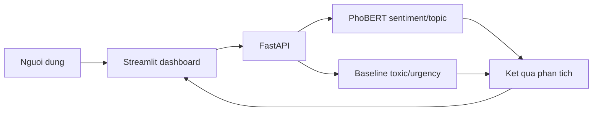

# Student Voice Intelligence

He thong NLP phan tich phan hoi sinh vien tieng Viet. Project ket hop data pipeline,
PhoBERT, FastAPI va Streamlit de phan tich mot feedback hoac xu ly hang loat tu CSV.

**Trang thai:** v2 da hoan thanh. Demo co the chay bang Docker API va Streamlit dashboard.

## Muc tieu

Project xu ly cac phan hoi dang text va du doan:

- `sentiment`: positive / neutral / negative
- `topic`: nhom chu de phan hoi
- `toxic`: co ngon ngu doc hai/xuc pham hay khong
- `urgency`: muc do can xu ly low / medium / high

## Demo v2



Dashboard ho tro:

- Phan tich mot feedback va hien sentiment, topic, toxic, urgency.
- Upload CSV co cot `text`, preview ket qua va tai CSV da du doan.
- Kiem tra ket noi API/model ngay tren giao dien.

## Quick start

Can co Docker Desktop va model tai `outputs/models/`. Build va chay API:

```powershell
docker build -t student-voice-api:1.0.0 .
docker run --rm -p 8000:8000 -v "${PWD}\outputs\models:/app/outputs/models:ro" student-voice-api:1.0.0
```

Mo terminal thu hai va chay dashboard:

```powershell
streamlit run dashboard/app.py
```

Truy cap dashboard tai `http://localhost:8501` va Swagger API tai
`http://127.0.0.1:8000/docs`.

## Trang thai hien tai

Da hoan thanh:

- Data merge NEU-ESC + UIT-VSFC
- EDA va bao cao du lieu
- Rule-based enrichment cho toxic, urgency, topic_group
- LLM review cho urgency candidates
- Baseline models bang TF-IDF + Logistic Regression / Linear SVM
- Notebook demo inference tren vai cau mau
- Fine-tune Transformer cho `sentiment_std_3class`
- So sanh 4 Transformer sentiment: XLM-R, PhoBERT-base-v2, ViDeBERTa, PhoBERT-large
- Chot `vinai/phobert-base-v2` lam model sentiment chinh
- Fine-tune Transformer cho `topic_group`
- So sanh 3 bien the PhoBERT topic: full class weight, no weight, sqrt class weight
- Chot `topic_phobertv2_noweight` lam model topic chinh
- Notebook demo inference tong hop
- FastAPI inference service cho demo end-to-end
- Automated API tests bang pytest
- Docker image cho FastAPI, mount model tu host
- Batch prediction tu file CSV
- Streamlit dashboard cho single feedback va CSV

Dang lam tiep:

- Phase 3: semantic search, RAG summary/report va dashboard analytics nang cao

## Cau truc thu muc

```text
Student Voice Intelligence/
|
|-- notebook/
|   |-- data/
|   |   |-- data_merge.ipynb
|   |   |-- eda.ipynb
|   |   |-- label_enrichment.ipynb
|   |   `-- llm_review_urgency.ipynb
|   |
|   `-- baseline/
|       |-- baseline_models.ipynb
|       `-- 06_baseline_inference_demo.ipynb
|   |
|   |-- demo/
|   |   `-- inference_student_voice.ipynb
|   |
|   `-- transformer/
|       |-- train_xlmr_sentiment.ipynb
|       |-- train_phobertv2_sentiment.ipynb
|       |-- train_videberta_sentiment.ipynb
|       |-- train_phobertlarge_sentiment.ipynb
|       |-- train_phobertv2_topic.ipynb
|       |-- train_phobertv2_topic_noweight.ipynb
|       `-- train_phobertv2_topic_sqrt_weight.ipynb
|
|-- src/
|   |-- __init__.py
|   `-- inference.py
|
|-- api/
|   |-- __init__.py
|   `-- app.py
|
|-- dashboard/
|   `-- app.py                 # Streamlit UI, goi FastAPI
|
|-- tests/
|   `-- test_api.py            # API contract tests
|
|-- data/
|   `-- processed/              # ignored by git
|
|-- datasets/                   # ignored by git
|-- outputs/
|   |-- reports/                # report ket qua
|   |-- figures/                # ignored by git
|   `-- models/                 # ignored by git
|
|-- PLAN.md
|-- note.txt
|-- requirements.txt
|-- .env.example
|-- Dockerfile
|-- .dockerignore
`-- feedback.csv               # sample CSV cho /predict-csv
```

## Data

Project dung 2 dataset:

- NEU-ESC: `hung20gg/NEU-ESC`
- UIT-VSFC: `uitnlp/vietnamese_students_feedback`

Do data CSV va model artifacts co the lon, repo dang ignore:

- `datasets/**/*.csv`
- `data/processed/*.csv`
- `outputs/models/`
- `outputs/figures/`

Nguoi dung moi can tai/chuan bi data goc truoc khi chay pipeline.

## File data chinh

Sau khi chay day du pipeline, file data chinh la:

```text
data/processed/student_voice_enriched_reviewed.csv
```

File nay gom:

- data da merge va chuan hoa
- `sentiment_std_3class`
- `topic_group`
- `is_toxic`
- `urgency_level_final`

Khi train PhoBERT, notebook se tao hoac dung lai file cache:

```text
data/processed/student_voice_enriched_reviewed_phobert.csv
```

File cache nay co them cot:

```text
text_phobert
```

## Thu tu chay notebook

Chay theo thu tu:

```text
notebook/data/data_merge.ipynb
notebook/data/eda.ipynb
notebook/data/label_enrichment.ipynb
notebook/data/llm_review_urgency.ipynb
notebook/baseline/baseline_models.ipynb
notebook/baseline/06_baseline_inference_demo.ipynb
notebook/transformer/train_xlmr_sentiment.ipynb
notebook/transformer/train_phobertv2_sentiment.ipynb
notebook/transformer/train_videberta_sentiment.ipynb
notebook/transformer/train_phobertlarge_sentiment.ipynb
notebook/transformer/train_phobertv2_topic.ipynb
notebook/transformer/train_phobertv2_topic_noweight.ipynb
notebook/transformer/train_phobertv2_topic_sqrt_weight.ipynb
```

## LLM API key

Notebook `llm_review_urgency.ipynb` co the dung OpenAI API de review urgency labels.

Tao file `.env` tu mau:

```text
OPENAI_API_KEY=sk-...
```

Khong commit `.env`. Repo chi commit `.env.example`.

Trong notebook LLM review, mac dinh nen test truoc:

```python
RUN_LLM_REVIEW = True
MAX_REVIEW_ROWS = 30
```

Sau khi ket qua on:

```python
MAX_REVIEW_ROWS = None
```

## Ket qua data hien tai

Sau merge:

```text
Rows: 49,141
Columns: 11
Empty text rows: 0
Duplicate text rows: 1
```

Sau LLM review urgency:

```text
Review candidates: 921
LLM reviewed rows: 921
LLM/rule disagreements: 309
Final urgency:
  low:    48,764
  medium:    335
  high:       42
```

## Baseline results

Best test results hien tai:

| Task | Best model | Accuracy | Macro-F1 | Weighted-F1 |
|---|---|---:|---:|---:|
| sentiment_3class | TF-IDF + Linear SVM | 0.819 | 0.812 | 0.819 |
| topic_group | TF-IDF + Linear SVM | 0.815 | 0.658 | 0.816 |
| toxic_binary | TF-IDF + Linear SVM | 0.992 | 0.901 | 0.991 |
| urgency_final | TF-IDF + Linear SVM | 0.996 | 0.751 | 0.996 |

Luu y:

- Sentiment la task sach nhat.
- Topic_group van lech lop, can doc macro-F1.
- Toxic va urgency co label enrichment/rule/LLM, khong nen chi nhin accuracy.
- Urgency `high` rat it, nen can than khi ket luan.

## Transformer sentiment results

Da fine-tune va danh gia 4 Transformer cho task:

```text
sentiment_std_3class
```

Ket qua test:

| Rank | Model | Accuracy | Macro-F1 | Weighted-F1 | Ghi chu |
|---:|---|---:|---:|---:|---|
| 1 | `vinai/phobert-base-v2` | 0.860 | 0.858 | 0.860 | Model sentiment chinh |
| 2 | `vinai/phobert-large` | 0.855 | 0.853 | 0.855 | Nang hon nhung khong tot hon base-v2 |
| 3 | `FacebookAI/xlm-roberta-base` | 0.855 | 0.852 | 0.855 | Multilingual baseline tot |
| 4 | `Fsoft-AIC/videberta-base` | 0.735 | 0.710 | 0.729 | Khong can uu tien tiep |
| 5 | `TF-IDF + Linear SVM` | 0.819 | 0.812 | 0.819 | Baseline classic |

Ket luan:

```text
vinai/phobert-base-v2
```

la model sentiment tot nhat hien tai, vua co macro-F1 cao nhat vua nhe hon PhoBERT-large.

Bang tong hop sentiment:

```text
outputs/reports/transformer/sentiment_model_comparison.csv
outputs/reports/transformer/sentiment_model_comparison.md
```

Model sentiment tot nhat duoc luu tren Drive tai:

```text
outputs/models/transformer/phobert_base_v2_sentiment_20260620_030200/model
```

## Transformer topic results

Da fine-tune `topic_group` voi `vinai/phobert-base-v2` theo 3 bien the:

| Rank | Model topic | Accuracy | Macro-F1 | Weighted-F1 | Ghi chu |
|---:|---|---:|---:|---:|---|
| 1 | `topic_phobertv2_noweight` | 0.848 | 0.722 | 0.846 | Model topic chinh |
| 2 | `topic_phobertv2_sqrt_weight` | 0.839 | 0.722 | 0.841 | Gan bang no-weight, tot hon cho mot so lop nho |
| 3 | `topic_phobertv2` full weight | 0.830 | 0.716 | 0.835 | Bi class weight keo manh, khong chon lam model chinh |
| 4 | `TF-IDF + Linear SVM` | 0.815 | 0.658 | 0.816 | Baseline classic |

Ket luan:

```text
topic_phobertv2_noweight
```

la model topic chinh hien tai vi co accuracy va weighted-F1 cao nhat, macro-F1 cung nhinh hon `sqrt_weight` mot chut. Ban `sqrt_weight` duoc giu lai nhu mot thuc nghiem tham khao neu muon uu tien them cac lop nho nhu `spam`.

Notebook topic:

```text
notebook/transformer/train_phobertv2_topic.ipynb
notebook/transformer/train_phobertv2_topic_noweight.ipynb
notebook/transformer/train_phobertv2_topic_sqrt_weight.ipynb
```

Report topic:

```text
outputs/reports/transformer/topic_phobertv2/
outputs/reports/transformer/topic_phobertv2_noweight/
outputs/reports/transformer/topic_phobertv2_sqrt_weight/
```

Model topic chinh duoc luu tren Drive tai:

```text
outputs/models/transformer/phobert_base_v2_topic_20260621_101250/model
```

## Inference notebook

Dung notebook demo:

```text
notebook/demo/inference_student_voice.ipynb
```

Notebook nay load 2 model Transformer chinh:

```text
outputs/models/transformer/phobertv2_sentiment
outputs/models/transformer/phobertv2_topic_noweight
```

Va load baseline toxic/urgency neu co:

```text
outputs/models/baseline/toxic_binary_tfidf_linear_svm.joblib
outputs/models/baseline/urgency_final_tfidf_linear_svm.joblib
```

Output gom:

- `sentiment`
- `topic`
- `toxic`
- `urgency`
- confidence cua sentiment/topic

## FastAPI demo

FastAPI dung chung logic voi notebook demo trong:

```text
src/inference.py
```

API app nam o:

```text
api/app.py
```

Cai dependencies:

```bash
pip install -r requirements.txt
```

Chay API tu thu muc project:

```bash
uvicorn api.app:app --reload
```

Mo Swagger UI:

```text
http://127.0.0.1:8000/docs
```

Cac endpoint chinh:

```text
GET  /
GET  /health
GET  /model-info
POST /predict
POST /predict-batch
POST /predict-csv
```

Vi du request `POST /predict`:

```json
{
  "text": "Wifi phong hoc qua yeu, may chieu bi mo nen rat kho hoc."
}
```

Vi du response:

```json
{
  "text": "Wifi phong hoc qua yeu, may chieu bi mo nen rat kho hoc.",
  "sentiment": "negative",
  "sentiment_confidence": 0.9895,
  "topic": "facilities",
  "topic_confidence": 0.9709,
  "toxic": 0,
  "urgency": "medium"
}
```

Luu y:

- `/health` chi kiem tra file model co ton tai, khong load model.
- `/model-info` va `/predict` se load model lan dau, co the mat vai chuc giay tren CPU.
- Model files khong nen push len GitHub. Can dat model local dung cac duong dan tren truoc khi chay API.

### Du doan tu CSV

Endpoint `POST /predict-csv` nhan mot file CSV UTF-8 co cot bat buoc `text`, toi da
5,000 dong. Response la file `student_voice_predictions.csv`, giu lai cac cot goc
va them `sentiment`, `topic`, `toxic`, `urgency` cung confidence cua sentiment/topic.

Vi du dung `curl`:

```bash
curl -X POST http://127.0.0.1:8000/predict-csv -F "file=@feedback.csv" -o student_voice_predictions.csv
```

Vi du `feedback.csv`:

```csv
student_id,text
sv-01,Wifi phong hoc qua yeu.
sv-02,Giang vien day de hieu va nhiet tinh.
```

## Docker

Can cai va mo Docker Desktop truoc khi chay. Docker image dung PyTorch CPU-only,
chi chua code va dependencies; model duoc mount tu may host de khong dua model
nhẹ len Git.

Build image tu thu muc project:

```bash
docker build -t student-voice-api:1.0.0 .
```

Chay container tren PowerShell va mount model theo che do chi doc:

```powershell
docker run --rm -p 8000:8000 `
  -v "${PWD}\outputs\models:/app/outputs/models:ro" `
  student-voice-api:1.0.0
```

Kiem tra API tu mot cua so PowerShell khac:

```powershell
Invoke-RestMethod http://127.0.0.1:8000/health
```

Sau do mo Swagger UI tai:

```text
http://127.0.0.1:8000/docs
```

Luu y: thu muc `outputs/models` tren may host phai co cac model voi dung ten
duong dan da mo ta o phan Inference notebook.

## Streamlit dashboard

Dashboard goi FastAPI, khong tu load model. Hay chay API truoc (local hoac Docker),
sau do mo mot terminal khac tai thu muc project:

```bash
streamlit run dashboard/app.py
```

Mac dinh dashboard ket noi toi `http://127.0.0.1:8000`. Co the doi API URL o
sidebar hoac dat bien moi truong `STUDENT_VOICE_API_URL` truoc khi chay.

Dashboard ho tro:

- Phan tich mot feedback va hien sentiment/topic/toxic/urgency.
- Upload CSV, preview bang ket qua va tai CSV da du doan.

## Kiem thu

Chay API contract tests ma khong can load PhoBERT/model that:

```bash
python -m pytest -q
```

Test bao phu endpoint health, single prediction, batch JSON va upload CSV.

## Reports

Sau khi chay notebook, cac report nam o:

```text
outputs/reports/data/data_merge_report.md
outputs/reports/data/eda_report.md
outputs/reports/data/label_enrichment_report.md
outputs/reports/data/llm_urgency_review_report.md
outputs/reports/baseline/baseline_report.md
outputs/reports/baseline/baseline_results.csv
outputs/reports/transformer/sentiment_model_comparison.csv
outputs/reports/transformer/sentiment_model_comparison.md
outputs/reports/transformer/xlmr/
outputs/reports/transformer/phobertv2/
outputs/reports/transformer/phobert_large/
outputs/reports/transformer/videberta/
outputs/reports/transformer/topic_phobertv2/
outputs/reports/transformer/topic_phobertv2_noweight/
outputs/reports/transformer/topic_phobertv2_sqrt_weight/
```

## Baseline inference demo

Dung notebook:

```text
notebook/baseline/06_baseline_inference_demo.ipynb
```

Notebook nay test nhanh tren danh sach `sample_texts` va tra ve:

- sentiment
- topic
- toxic
- urgency

Neu da chay `baseline_models.ipynb`, demo se load model tu:

```text
outputs/models/baseline/
```

Neu chua co model saved, demo co fallback train lai.

## Ghi chu ve GitHub

Nen push:

- notebooks
- source code
- reports
- `PLAN.md`
- `.gitignore`
- `.env.example`
- `README.md`

Khong nen push:

- `.env`
- dataset CSV
- processed CSV
- model files
- vector DB
- generated figures neu khong can
