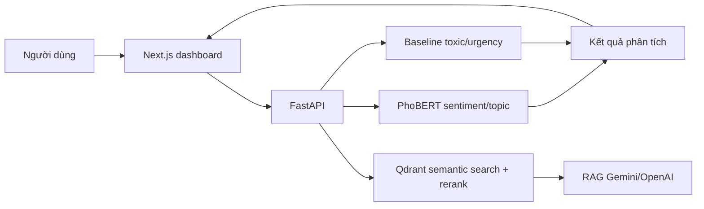

# Student Voice Intelligence

Hệ thống NLP phân tích phản hồi sinh viên tiếng Việt. Project kết hợp data pipeline,
PhoBERT, FastAPI, Qdrant và Next.js để phân tích feedback, truy xuất ngữ nghĩa và tổng hợp có dẫn chứng.

**Trạng thái:** v3.0.0 đã hoàn thành và được kiểm thử local: 25 pytest cases pass, bộ đánh giá RAG 8/8 case pass.

## Muc tieu

Project xu ly cac phan hoi dang text va du doan:

- `sentiment`: positive / neutral / negative
- `topic`: nhom chu de phan hoi
- `toxic`: co ngon ngu doc hai/xuc pham hay khong
- `urgency`: muc do can xu ly low / medium / high

## Tổng quan v3



Dashboard chính tại Next.js hỗ trợ:

- Overview voi metric tong feedback, sentiment, urgency va toxic.
- Data analytics voi filter, negative feedback theo topic, urgency theo topic va sentiment x topic.
- Phan tich mot feedback va hien sentiment, topic, toxic, urgency.
- Upload CSV co cot `text`, preview ket qua va tai CSV da du doan.
- Kiem tra ket noi API/model ngay tren giao dien.
- Tim feedback gan nghia qua Qdrant vector database.
- Hỏi đáp RAG dựa trên feedback đã truy xuất, có citation và evidence gốc qua Gemini hoặc OpenAI.
- Duyệt thủ công mức độ urgency; giá trị đã duyệt được lưu riêng, không sửa CSV gốc.
- Tạo và lưu báo cáo Markdown từ analytics cùng feedback đại diện đã rerank.
- Khám phá cụm chủ đề mới từ feedback và duyệt hoặc loại bỏ từng cụm.

## Quick start

Cần có Docker Desktop, dữ liệu đã xử lý tại `data/processed/` và model tại `outputs/models/`.
Khởi động stack chính:

```bash
docker compose up --build -d --force-recreate api dashboard
```

Truy cap Next.js dashboard tai `http://localhost:8501` va Swagger API tai
`http://127.0.0.1:8000/docs`. Streamlit cu van duoc giu de doi chieu tai
`http://localhost:8502`.

## Trạng thái hiện tại

Da hoan thanh:

- Data merge NEU-ESC + UIT-VSFC
- EDA va bao cao du lieu
- Rule-based enrichment cho toxic, urgency, topic_group
- LLM review cho urgency candidates
- Baseline models bang TF-IDF + Logistic Regression / Linear SVM
- Notebook demo inference tren vai cau mau
- Fine-tune Transformer cho `sentiment_std_3class`
- So sanh 4 Transformer sentiment: XLM-R, PhoBERT-base-v2, ViDeBERTa, PhoBERT-large
- Chot `vinai/phobert-base-v2` lam model sentiment chinh
- Fine-tune Transformer cho `topic_group`
- So sanh 3 bien the PhoBERT topic: full class weight, no weight, sqrt class weight
- Chot `topic_phobertv2_noweight` lam model topic chinh
- Notebook demo inference tong hop
- FastAPI inference service cho demo end-to-end
- Automated API tests bang pytest
- Docker image cho FastAPI, mount model tu host
- Batch prediction tu file CSV
- Next.js + Tailwind dashboard cho overview, analytics, prediction, CSV, semantic search va RAG
- Semantic search Qdrant voi Vietnamese SBERT va CrossEncoder reranking
- Grounded RAG chatbot với Gemini hoặc OpenAI: trả lời kèm feedback làm bằng chứng và từ chối khi không đủ dữ liệu
- Manual review urgency lưu SQLite và được analytics/report sử dụng
- Report generation có số liệu, evidence và lịch sử report
- Topic discovery với TF-IDF + MiniBatchKMeans, có bước người dùng duyệt cụm
- Bộ đánh giá RAG gồm 8 case, hỗ trợ filter theo topic/sentiment/urgency/toxic

## Cau truc thu muc

```text
Student Voice Intelligence/
|
|-- notebook/
|   |-- data/
|   |   |-- data_merge.ipynb
|   |   |-- eda.ipynb
|   |   |-- label_enrichment.ipynb
|   |   `-- llm_review_urgency.ipynb
|   |
|   `-- baseline/
|       |-- baseline_models.ipynb
|       `-- 06_baseline_inference_demo.ipynb
|   |
|   |-- demo/
|   |   `-- inference_student_voice.ipynb
|   |
|   `-- transformer/
|       |-- train_xlmr_sentiment.ipynb
|       |-- train_phobertv2_sentiment.ipynb
|       |-- train_videberta_sentiment.ipynb
|       |-- train_phobertlarge_sentiment.ipynb
|       |-- train_phobertv2_topic.ipynb
|       |-- train_phobertv2_topic_noweight.ipynb
|       `-- train_phobertv2_topic_sqrt_weight.ipynb
|
|-- src/
|   |-- inference.py
|   |-- retrieval.py            # Qdrant retrieval + CrossEncoder rerank
|   |-- reranker.py
|   |-- rag.py                  # Gemini/OpenAI grounded generation
|   |-- analytics.py
|   |-- storage.py              # SQLite state store
|   |-- reviews.py              # manual urgency review
|   |-- reporting.py
|   `-- topic_discovery.py
|
|-- api/
|   |-- __init__.py
|   `-- app.py
|
|-- dashboard/
|   `-- app.py                 # Streamlit UI, goi FastAPI
|
|-- web/                       # Next.js + Tailwind dashboard chinh
|   |-- app/
|   `-- components/
|
|-- scripts/
|   |-- build_vector_index.py  # Tao embedding va upsert vao Qdrant
|   `-- evaluate_rag.py        # Chay bo danh gia RAG
|
|-- tests/
|   |-- test_api.py            # API contract tests
|   |-- test_retrieval.py
|   `-- test_v3_features.py
|
|-- data/
|   |-- evaluation/rag_test_cases.csv
|   `-- processed/              # ignored by git
|
|-- datasets/                   # ignored by git
|-- outputs/
|   |-- reports/                # report ket qua
|   |-- figures/                # ignored by git
|   |-- models/                 # ignored by git
|   `-- app_state/              # SQLite local state, ignored by git
|
|-- PLAN.md
|-- note.txt
|-- requirements.txt
|-- .env.example
|-- Dockerfile
|-- .dockerignore
|-- docker-compose.yml
`-- feedback.csv               # sample CSV cho /predict-csv
```

## Data

Project dung 2 dataset:

- NEU-ESC: `hung20gg/NEU-ESC`
- UIT-VSFC: `uitnlp/vietnamese_students_feedback`

Do data CSV va model artifacts co the lon, repo dang ignore:

- `datasets/**/*.csv`
- `data/processed/*.csv`
- `outputs/models/`
- `outputs/figures/`

Nguoi dung moi can tai/chuan bi data goc truoc khi chay pipeline.

## File data chinh

Sau khi chay day du pipeline, file data chinh la:

```text
data/processed/student_voice_enriched_reviewed.csv
```

File nay gom:

- data da merge va chuan hoa
- `sentiment_std_3class`
- `topic_group`
- `is_toxic`
- `urgency_level_final`

Khi train PhoBERT, notebook se tao hoac dung lai file cache:

```text
data/processed/student_voice_enriched_reviewed_phobert.csv
```

File cache nay co them cot:

```text
text_phobert
```

## Thu tu chay notebook

Chay theo thu tu:

```text
notebook/data/data_merge.ipynb
notebook/data/eda.ipynb
notebook/data/label_enrichment.ipynb
notebook/data/llm_review_urgency.ipynb
notebook/baseline/baseline_models.ipynb
notebook/baseline/06_baseline_inference_demo.ipynb
notebook/transformer/train_xlmr_sentiment.ipynb
notebook/transformer/train_phobertv2_sentiment.ipynb
notebook/transformer/train_videberta_sentiment.ipynb
notebook/transformer/train_phobertlarge_sentiment.ipynb
notebook/transformer/train_phobertv2_topic.ipynb
notebook/transformer/train_phobertv2_topic_noweight.ipynb
notebook/transformer/train_phobertv2_topic_sqrt_weight.ipynb
```

## LLM API key

Notebook `llm_review_urgency.ipynb` co the dung OpenAI API de review urgency labels.

Tao file `.env` tu mau:

```text
OPENAI_API_KEY=sk-...
```

Khong commit `.env`. Repo chi commit `.env.example`.

Trong notebook LLM review, mac dinh nen test truoc:

```python
RUN_LLM_REVIEW = True
MAX_REVIEW_ROWS = 30
```

Sau khi ket qua on:

```python
MAX_REVIEW_ROWS = None
```

## Ket qua data hien tai

Sau merge:

```text
Rows: 49,141
Columns: 11
Empty text rows: 0
Duplicate text rows: 1
```

Sau LLM review urgency:

```text
Review candidates: 921
LLM reviewed rows: 921
LLM/rule disagreements: 309
Final urgency:
  low:    48,764
  medium:    335
  high:       42
```

## Baseline results

Best test results hien tai:

| Task | Best model | Accuracy | Macro-F1 | Weighted-F1 |
|---|---|---:|---:|---:|
| sentiment_3class | TF-IDF + Linear SVM | 0.819 | 0.812 | 0.819 |
| topic_group | TF-IDF + Linear SVM | 0.815 | 0.658 | 0.816 |
| toxic_binary | TF-IDF + Linear SVM | 0.992 | 0.901 | 0.991 |
| urgency_final | TF-IDF + Linear SVM | 0.996 | 0.751 | 0.996 |

Luu y:

- Sentiment la task sach nhat.
- Topic_group van lech lop, can doc macro-F1.
- Toxic va urgency co label enrichment/rule/LLM, khong nen chi nhin accuracy.
- Urgency `high` rat it, nen can than khi ket luan.

## Transformer sentiment results

Da fine-tune va danh gia 4 Transformer cho task:

```text
sentiment_std_3class
```

Ket qua test:

| Rank | Model | Accuracy | Macro-F1 | Weighted-F1 | Ghi chu |
|---:|---|---:|---:|---:|---|
| 1 | `vinai/phobert-base-v2` | 0.860 | 0.858 | 0.860 | Model sentiment chinh |
| 2 | `vinai/phobert-large` | 0.855 | 0.853 | 0.855 | Nang hon nhung khong tot hon base-v2 |
| 3 | `FacebookAI/xlm-roberta-base` | 0.855 | 0.852 | 0.855 | Multilingual baseline tot |
| 4 | `Fsoft-AIC/videberta-base` | 0.735 | 0.710 | 0.729 | Khong can uu tien tiep |
| 5 | `TF-IDF + Linear SVM` | 0.819 | 0.812 | 0.819 | Baseline classic |

Ket luan:

```text
vinai/phobert-base-v2
```

la model sentiment tot nhat hien tai, vua co macro-F1 cao nhat vua nhe hon PhoBERT-large.

Bang tong hop sentiment:

```text
outputs/reports/transformer/sentiment_model_comparison.csv
outputs/reports/transformer/sentiment_model_comparison.md
```

Model sentiment tot nhat duoc luu tren Drive tai:

```text
outputs/models/transformer/phobert_base_v2_sentiment_20260620_030200/model
```

## Transformer topic results

Da fine-tune `topic_group` voi `vinai/phobert-base-v2` theo 3 bien the:

| Rank | Model topic | Accuracy | Macro-F1 | Weighted-F1 | Ghi chu |
|---:|---|---:|---:|---:|---|
| 1 | `topic_phobertv2_noweight` | 0.848 | 0.722 | 0.846 | Model topic chinh |
| 2 | `topic_phobertv2_sqrt_weight` | 0.839 | 0.722 | 0.841 | Gan bang no-weight, tot hon cho mot so lop nho |
| 3 | `topic_phobertv2` full weight | 0.830 | 0.716 | 0.835 | Bi class weight keo manh, khong chon lam model chinh |
| 4 | `TF-IDF + Linear SVM` | 0.815 | 0.658 | 0.816 | Baseline classic |

Ket luan:

```text
topic_phobertv2_noweight
```

la model topic chinh hien tai vi co accuracy va weighted-F1 cao nhat, macro-F1 cung nhinh hon `sqrt_weight` mot chut. Ban `sqrt_weight` duoc giu lai nhu mot thuc nghiem tham khao neu muon uu tien them cac lop nho nhu `spam`.

Notebook topic:

```text
notebook/transformer/train_phobertv2_topic.ipynb
notebook/transformer/train_phobertv2_topic_noweight.ipynb
notebook/transformer/train_phobertv2_topic_sqrt_weight.ipynb
```

Report topic:

```text
outputs/reports/transformer/topic_phobertv2/
outputs/reports/transformer/topic_phobertv2_noweight/
outputs/reports/transformer/topic_phobertv2_sqrt_weight/
```

Model topic chinh duoc luu tren Drive tai:

```text
outputs/models/transformer/phobert_base_v2_topic_20260621_101250/model
```

## Inference notebook

Dung notebook demo:

```text
notebook/demo/inference_student_voice.ipynb
```

Notebook nay load 2 model Transformer chinh:

```text
outputs/models/transformer/phobertv2_sentiment
outputs/models/transformer/phobertv2_topic_noweight
```

Va load baseline toxic/urgency neu co:

```text
outputs/models/baseline/toxic_binary_tfidf_linear_svm.joblib
outputs/models/baseline/urgency_final_tfidf_linear_svm.joblib
```

Output gom:

- `sentiment`
- `topic`
- `toxic`
- `urgency`
- confidence cua sentiment/topic

## FastAPI demo

FastAPI dung chung logic voi notebook demo trong:

```text
src/inference.py
```

API app nam o:

```text
api/app.py
```

Cai dependencies:

```bash
pip install -r requirements.txt
```

Chay API tu thu muc project:

```bash
uvicorn api.app:app --reload
```

Mo Swagger UI:

```text
http://127.0.0.1:8000/docs
```

Cac endpoint chinh:

```text
GET  /
GET  /health
GET  /model-info
POST /predict
POST /predict-batch
POST /predict-csv
```

Vi du request `POST /predict`:

```json
{
  "text": "Wifi phong hoc qua yeu, may chieu bi mo nen rat kho hoc."
}
```

Vi du response:

```json
{
  "text": "Wifi phong hoc qua yeu, may chieu bi mo nen rat kho hoc.",
  "sentiment": "negative",
  "sentiment_confidence": 0.9895,
  "topic": "facilities",
  "topic_confidence": 0.9709,
  "toxic": 0,
  "urgency": "medium"
}
```

Luu y:

- `/health` chi kiem tra file model co ton tai, khong load model.
- `/model-info` va `/predict` se load model lan dau, co the mat vai chuc giay tren CPU.
- Model files khong nen push len GitHub. Can dat model local dung cac duong dan tren truoc khi chay API.

### Du doan tu CSV

Endpoint `POST /predict-csv` nhan mot file CSV UTF-8 co cot bat buoc `text`, toi da
5,000 dong. Response la file `student_voice_predictions.csv`, giu lai cac cot goc
va them `sentiment`, `topic`, `toxic`, `urgency` cung confidence cua sentiment/topic.

Vi du dung `curl`:

```bash
curl -X POST http://127.0.0.1:8000/predict-csv -F "file=@feedback.csv" -o student_voice_predictions.csv
```

Vi du `feedback.csv`:

```csv
student_id,text
sv-01,Wifi phong hoc qua yeu.
sv-02,Giang vien day de hieu va nhiet tinh.
```

## Docker

Can cai va mo Docker Desktop truoc khi chay. Docker image dung PyTorch CPU-only,
chi chua code va dependencies; model duoc mount tu may host de khong dua model
nhẹ len Git.

Build image tu thu muc project:

```bash
docker build -t student-voice-api:1.0.0 .
```

Chay container tren PowerShell va mount model theo che do chi doc:

```powershell
docker run --rm -p 8000:8000 `
  -v "${PWD}\outputs\models:/app/outputs/models:ro" `
  student-voice-api:1.0.0
```

Kiem tra API tu mot cua so PowerShell khac:

```powershell
Invoke-RestMethod http://127.0.0.1:8000/health
```

Sau do mo Swagger UI tai:

```text
http://127.0.0.1:8000/docs
```

Luu y: thu muc `outputs/models` tren may host phai co cac model voi dung ten
duong dan da mo ta o phan Inference notebook.

## Streamlit dashboard

Dashboard goi FastAPI, khong tu load model. Hay chay API truoc (local hoac Docker),
sau do mo mot terminal khac tai thu muc project:

```bash
streamlit run dashboard/app.py
```

Mac dinh dashboard ket noi toi `http://127.0.0.1:8000`. Co the doi API URL o
sidebar hoac dat bien moi truong `STUDENT_VOICE_API_URL` truoc khi chay.

Dashboard ho tro:

- Phan tich mot feedback va hien sentiment/topic/toxic/urgency.
- Upload CSV, preview bang ket qua va tai CSV da du doan.
- Tim semantic feedback tuong tu sau khi Qdrant index da duoc tao.

## Semantic search voi Qdrant

Qdrant chay local trong Docker, luu vector embedding va metadata cua feedback.
`qdrant_storage` la Docker volume nen index van con sau khi restart container.

Khoi dong full stack:

```bash
docker compose up --build -d qdrant api dashboard
```

Tao index tu data da xu ly. Lenh nay chi can chay lai khi corpus thay doi:

```bash
docker compose run --rm api python -m scripts.build_vector_index --recreate
```

Kiem tra index:

```text
GET http://127.0.0.1:8000/search-health
```

Search qua API:

```json
POST /search
{
  "query": "wifi phong hoc qua yeu",
  "top_k": 5,
  "topic": "facilities"
}
```

`topic`, `sentiment`, `urgency` va `toxic` la filter tuy chon. Qdrant lay 20
ung vien theo cosine similarity, sau do cross-encoder
`cross-encoder/mmarco-mMiniLMv2-L12-H384-v1` rerank va tra `top_k` ket qua.
Response co `vector_score` va `rerank_score`. Qdrant chi bind cong 6333 vao
localhost; khong expose cong nay khi deploy public.

## Dashboard analytics

API `GET /analytics` doc file enriched da mount vao service `api`, tong hop phan bo
dataset, sentiment, topic, urgency, toxic va cac bang cheo. Cac filter tuy chon la
`dataset`, `topic`, `sentiment`, `urgency` va `toxic`; dashboard goi API nay cho
hai tab **Tong quan** va **Phan tich du lieu**.

```text
GET /analytics?topic=facilities&sentiment=negative
```

## RAG chatbot với Gemini hoặc OpenAI

RAG tái sử dụng semantic retrieval + CrossEncoder reranking để lấy feedback làm
bằng chứng trước khi gọi LLM. Prompt chỉ cho phép LLM trả lời từ evidence;
nếu không đủ thông tin, chatbot phải trả lời `Không đủ dữ liệu để kết luận.`

Tạo file `.env` local từ `.env.example` và đặt key thật vào đó. Không commit
`.env` hoặc API key lên GitHub:

```env
GEMINI_API_KEY=your-gemini-api-key
GEMINI_MODEL=gemini-2.0-flash
RAG_TOP_K=6
```

Chọn Gemini:

```env
LLM_PROVIDER=gemini
GEMINI_API_KEY=your-gemini-api-key
GEMINI_MODEL=gemini-2.5-flash
```

Chọn OpenAI với `gpt-4o-mini`:

```env
LLM_PROVIDER=openai
OPENAI_API_KEY=sk-your-openai-api-key
OPENAI_MODEL=gpt-4o-mini
```

Sau khi thay đổi `.env` hoặc code RAG, recreate API và dashboard:

```powershell
docker compose up --build -d api dashboard
```

Trong dashboard, tab **RAG Chatbot** hỗ trợ các filter `topic`, `sentiment`,
`urgency` và `toxic`. Khi hỏi về phòng học, nên chọn `topic=facilities` và
`sentiment=negative` để context chỉ gồm feedback liên quan.

```json
POST /ask
{
  "question": "Sinh viên đang phàn nàn gì về Wi-Fi và phòng học?",
  "top_k": 6,
  "topic": "facilities",
  "sentiment": "negative"
}
```

Response gồm `answer`, `evidence`, `retrieved_count` và `grounded`. `evidence`
luôn giữ feedback gốc, metadata và `rerank_score` để kiểm tra các citation trong
câu trả lời. Với câu hỏi ngoài phạm vi dữ liệu, chatbot không được bịa thông tin.

## Kiểm thử

Chạy toàn bộ test trên Windows. Dùng thư mục tạm trong profile người dùng để tránh lỗi quyền
ở `C:\Users\...\Temp\pytest-of-...`:

```powershell
$pytestRoot = Join-Path $HOME "student-voice-pytest"
New-Item -ItemType Directory -Force $pytestRoot | Out-Null
$pytestTemp = Join-Path $pytestRoot ("run-" + [guid]::NewGuid().ToString("N"))
python -m pytest -q -p no:cacheprovider --basetemp="$pytestTemp"
```

Kết quả tại thời điểm phát hành v3: `25 passed`.

## Reports

Sau khi chay notebook, cac report nam o:

```text
outputs/reports/data/data_merge_report.md
outputs/reports/data/eda_report.md
outputs/reports/data/label_enrichment_report.md
outputs/reports/data/llm_urgency_review_report.md
outputs/reports/baseline/baseline_report.md
outputs/reports/baseline/baseline_results.csv
outputs/reports/transformer/sentiment_model_comparison.csv
outputs/reports/transformer/sentiment_model_comparison.md
outputs/reports/transformer/xlmr/
outputs/reports/transformer/phobertv2/
outputs/reports/transformer/phobert_large/
outputs/reports/transformer/videberta/
outputs/reports/transformer/topic_phobertv2/
outputs/reports/transformer/topic_phobertv2_noweight/
outputs/reports/transformer/topic_phobertv2_sqrt_weight/
```

## Baseline inference demo

Dung notebook:

```text
notebook/baseline/06_baseline_inference_demo.ipynb
```

Notebook nay test nhanh tren danh sach `sample_texts` va tra ve:

- sentiment
- topic
- toxic
- urgency

Neu da chay `baseline_models.ipynb`, demo se load model tu:

```text
outputs/models/baseline/
```

Neu chua co model saved, demo co fallback train lai.

## Ghi chu ve GitHub

Nen push:

- notebooks
- source code
- reports
- `PLAN.md`
- `.gitignore`
- `.env.example`
- `README.md`

Không nên push:

- `.env`
- dataset CSV
- processed CSV
- model files
- vector DB
- generated figures neu khong can
- `outputs/app_state/` và mọi file SQLite tạo khi review/report/discovery
- `outputs/reports/rag_evaluation.csv` vì đây là kết quả chạy local
- `.pytest-*`, `web/.next/`, `web/node_modules/`

## V3: vận hành và đánh giá

Các chức năng vận hành của v3 dùng SQLite tại `outputs/app_state/student_voice.db`.
File này là dữ liệu cục bộ, đã được bỏ qua bởi Git và không làm thay đổi CSV đã xử lý.

- **Duyệt urgency**: mở dashboard, chọn `Duyệt urgency`, xác nhận `high`, `medium` hoặc `low`.
  Analytics và report sẽ dùng giá trị đã duyệt ở lần tải kế tiếp.
- **Báo cáo tự động**: trang `Báo cáo` tạo Markdown từ số liệu analytics và feedback đại diện
  đã qua rerank. Report được lưu trong SQLite, không phụ thuộc API LLM.
- **Khám phá chủ đề**: trang `Khám phá chủ đề` chạy TF-IDF + MiniBatchKMeans trên feedback của
  một topic (mặc định `others`). Mỗi cụm cần được người dùng duyệt hoặc loại bỏ; topic gốc không
  tự bị ghi đè.

Các API tương ứng:

```text
GET  /reviews?state=pending&urgency=high
POST /reviews/{feedback_id}
POST /reports/generate
GET  /reports
POST /topic-discovery/run
GET  /topic-discovery/clusters
POST /topic-discovery/clusters/{cluster_id}/approve
POST /topic-discovery/clusters/{cluster_id}/reject
```

Đánh giá RAG bằng bộ câu hỏi có sẵn:

```powershell
python scripts/evaluate_rag.py
```

Script gọi API `/ask` và ghi kết quả vào `outputs/reports/rag_evaluation.csv`. Các cột
`behavior_correct`, `topic_correct` và `keyword_score` là kiểm tra tự động; cần đọc lại câu trả
lời và evidence để đánh giá chất lượng cuối cùng.
